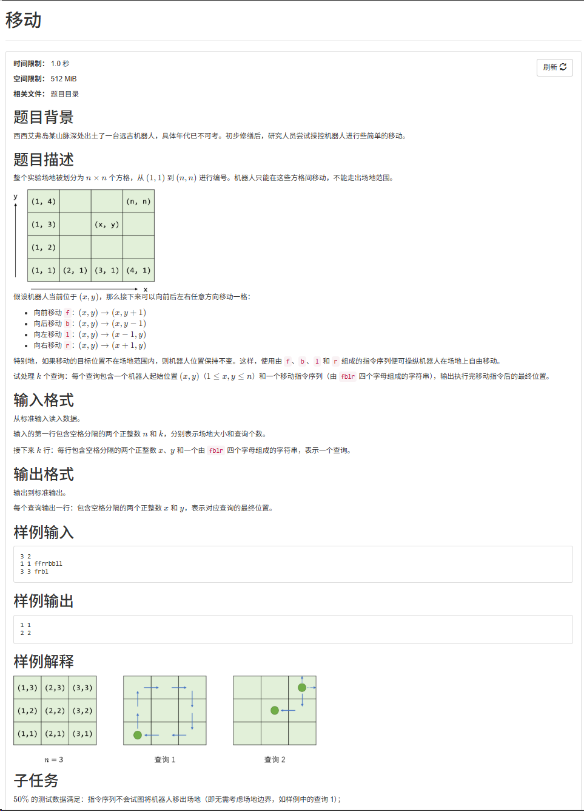
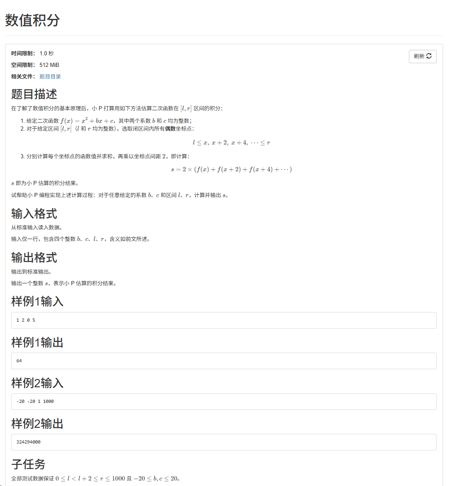

CSP 不到 120 不让毕业，正在备战 2026 年 12 月的考试。

:::collapse[36届CCF/CSP记录]

:::collapse[移动]


36 届第一题，还是小模拟。唯一的门槛在「撞墙」怎么算。

:::collapse[题目]
$n \times n$ 的场地，方格从 $(1,1)$ 编号到 $(n,n)$，机器人初始在 $(x, y)$，只能在场内移动。给一串指令，每条按方向走一格：

- `f` 向前：$(x, y) \to (x, y+1)$
- `b` 向后：$(x, y) \to (x, y-1)$
- `l` 向左：$(x, y) \to (x-1, y)$
- `r` 向右：$(x, y) \to (x+1, y)$

**如果这一步会走出场地，机器人保持不动**（不是绕到对面）。共有 $k$ 个查询，每个查询给一对初始位置和一串指令，逐条走完输出最终位置。

- 输入：第一行 $n\ k$；接下来 $k$ 行，每行 `x y 指令串`
- 输出：$k$ 行，每行最终位置 `x y`
- 样例：$n = 3$ 时，`1 1 ffrrbbll` → `1 1`，`3 3 frbl` → `2 2`
  :::

:::collapse[思路]

方向映射很简单：`f` / `b` 改 $y$，`l` / `r` 改 $x$。逐条指令模拟，每条 $O(1)$，总复杂度 $O(\sum |s|)$，暴力直接过。

关键就一句话：**移出场地就原地不动**，等价于把坐标夹在 $[1, n]$ 里——先算出候选位置，越界就撤销这一步。千万别写成「走出去从另一头穿出来」的取模环绕。
:::

:::collapse[代码]

```cpp
#include<bits/stdc++.h>
#include<string>
#include<vector>
using namespace std;

int main() {
    int n, k;
    cin >> n >> k;
    for(int i = 0; i < k; i++) {
        string options;
        int x, y; //初始位置
        cin >> x >> y >> options;
        for(int j = 0; j < options.size(); j++) {
            if(options[j] == 'f'){
                y += 1;
                if(y > n) y -= 1;
            }else if(options[j] == 'r'){
                x += 1;
                if(x > n) x -= 1;
            }else if(options[j] == 'b'){
                y -= 1;
                if(y < 1) y += 1;
            }else if(options[j] == 'l'){
                x -= 1;
                if(x < 1) x += 1;
            }
        }
        cout << x << " " << y << "\n";
    }
    return 0;
}
```

:::

:::collapse[踩的坑]

**1. 边界不是取模环绕**

「目标位置不在场地范围内就保持不动」和「从另一头穿出来」是两回事。写成 `(y % n) + 1` 这种环绕，样例里的第二个查询立刻就挂。

**2. `options.size()` 是无符号的**

`for (int j = 0; j < options.size(); j++)` 是 `int` 和 `size_t` 比较，开 `-Wall` 会报 `-Wsign-compare`。字符串非空时结果没错，但这和「vector 数组」那节里记的是同一条坑，写成 `(int)options.size()` 或者直接范围 for 更省心。

:::

:::

:::

:::collapse[37届CCF/CSP记录]

:::collapse[数值积分]


37 届第一题，照着定义算就行。唯一的坑在起点：采样点永远取**偶数**坐标。

:::collapse[题目]
给定二次函数 $f(x) = x^2 + bx + c$（$b$、$c$ 为整数）和整数区间 $[l, r]$，取区间内**所有偶数坐标点**，算出每个点的函数值求和，再乘上坐标点间距 2：

$$
s = 2 \times (f(x) + f(x+2) + f(x+4) + \cdots)
$$

输出整数 $s$。

- 输入：一行四个整数 $b\ c\ l\ r$
- 输出：一个整数 $s$
- 范围：$0 \le l < l+2 \le r \le 1000$，$-20 \le b, c \le 20$
- 样例 1：`1 2 0 5` → `64`
- 样例 2：`-20 -20 1 1000` → `324294000`
  :::

:::collapse[思路]
把定义原样翻译成循环：从区间内第一个偶数坐标点开始，步长 2 枚举所有偶数点，累加 $f(x)$，最后乘 2。

**起点怎么定**是唯一要想一下的地方：$l$ 是偶数就从 $l$ 起步；$l$ 是奇数就得从 $l+1$ 起步，因为采样点只取偶数。

总复杂度 $O\bigl((r-l)/2\bigr)$，$r \le 1000$ 时是最多 500 次循环，随便过。
:::

:::collapse[代码]

```cpp
#include <bits/stdc++.h>

using namespace std;

int f(int b, int c, int x) { return (x * x) + (b * x) + c; }
int main() {
    int b, c, l, r;
    cin >> b >> c >> l >> r;
    int p = 0, m = 0;
    if (l % 2 != 0) {
        p = 1;
    }
    for (int i = l + p; i <= r; i += 2) {
        m += f(b, c, i);
    }
    cout << m * 2;
    return 0;
}
```

:::

:::collapse[踩的坑]

**1. 起点的奇偶**

最容易写成 `for (int i = l; i <= r; i += 2)`。$l$ 是偶数时看不出问题，样例 1 也照过；可样例 2 的 $l = 1$ 是奇数，这么写会把 1、3、5…… 这些奇数点也算进去，直接错。

正确做法是先把 $l$ 修正成「$\ge l$ 的最小偶数」，也就是 $l$ 为奇数时从 $l+1$ 起步。

**2. 顺带确认 `int` 够用**

$r \le 1000$、$|b|, |c| \le 20$，最坏情况（$b = c = 20$ 且从 $l = 0$ 取满偶数点）总和约 $1.7 \times 10^8$，乘 2 之后约 $3.4 \times 10^8$，还在 `int` 上限（$2.1 \times 10^9$）以内，所以这题不会溢出。换成范围更大的题就要上 `long long` 了。

:::

:::

:::

:::collapse[39届CCF/CSP记录]

:::collapse[蒙特卡洛]


这道题简简单单的小模拟题，只需要掌握高中数学即可。

:::collapse[题目]
正方形 $[-a, a]^2$ 里有个半径 $a$ 的圆，给 $n$ 个点，数圆内（含边界）的点数 $m$，输出 $4m/n$。

- 输入：$n\ a$，后面 $n$ 行坐标
- 输出：一个实数，保留六位小数
- 范围：$n, a \le 1000$，坐标最多两位小数
  :::

:::collapse[思路]
圆的方程 $x^2 + y^2 = a^2$，圆心在原点，所以判据就是 $x^2 + y^2 \le a^2$。

正方形面积 $4a^2$，圆面积 $\pi a^2$，点在正方形里均匀撒，落在圆内的概率是 $\pi/4$。用 $m/n$ 近似它：

$$
\frac{m}{n} \approx \frac{\pi}{4} \quad\Longrightarrow\quad \pi \approx \frac{4m}{n}
$$

数一遍点就行，$O(n)$。
:::

:::collapse[代码]

```cpp
#include<bits/stdc++.h>
using namespace std;
//随机生成概率 最后计算 4m/n即可
int main() {

    int n, a, m = 0;
    cin >> n >> a;
    for(int i = 0; i < n; i++) {
        double x, y;
        cin >> x >> y;
        if((x * x) + (y * y) <= (a * a)){
            //cout << "current:" << x << "|" << y << endl;
            m++;
        }
    }
    double result = (4 * m) / n;
    printf("%.6f", result);
    return 0;
}
```

:::

:::collapse[踩的坑]
**1. 忘了圆的方程**

卡了半天，想不起来点在圆内怎么判。

就是 $x^2 + y^2 = a^2$，所以 $x^2 + y^2 \le a^2$ 在圆内。

**2. `4 * m / n` 是整数除法**

`m`、`n` 都是 `int`，`(4 * m) / n` 先截断再转 `double`。样例 1 的 $12/4$ 整除，看不出来；样例 2 的 $12/5$ 直接变成 2，输出 `2.000000`，答案是 2.4。

改成 `4.0 * m / n`。

**3. 含边界**

判据是 `<=` 不是 `<`。样例 2 的 $(-3,-4)$ 正好在圆上（$9+16=25$），漏掉它答案就变成 `1.6`。

:::

:::
:::

## 目标

| 项目 | 内容                   |
| ---- | ---------------------- |
| 考试 | CCF CSP，2026 年 12 月 |
| 目标 | 总分 ≥ 120             |

## 计划

- [ ] 每天两道大模拟题
- [ ] 刷历年真题，从里面找规律
- [ ] 每道题的思路和坑都记下来

## vector 数组

刷题最常用的容器，比裸数组省心，尤其是不定长和二维的时候。

**1. 定义与初始化**

| 写法                                 | 含义                  |
| ------------------------------------ | --------------------- |
| `vector<int> a;`                     | 空数组，`size() == 0` |
| `vector<int> a(n);`                  | $n$ 个 `0`            |
| `vector<int> a(n, x);`               | $n$ 个 `x`            |
| `vector<int> a{1, 2, 3};`            | 初始化列表            |
| `vector<int> b(a);`                  | 拷贝一份（$O(n)$）    |
| `vector<int> b(a.begin(), a.end());` | 按区间构造            |

```cpp
#include <bits/stdc++.h>
using namespace std;

int main() {
    int n = 5;
    vector<int> a;           // 空
    vector<int> b(n);        // 5 个 0
    vector<int> c(n, -1);    // 5 个 -1
    vector<int> d{1, 2, 3};  // 1 2 3
    vector<int> e = c;       // 拷贝，e 改了不影响 c
}
```

**2. 二维数组**

```cpp
// n 行 m 列，全部初始化为 0
vector<vector<int>> g(n, vector<int>(m, 0));

// 行数已知、列数不定：逐行 push_back
vector<vector<int>> h(n);
for (int i = 0; i < n; i++) h[i].push_back(x);

// 或者先建 n 行空行，再逐行 resize
vector<vector<int>> k(n);
for (int i = 0; i < n; i++) k[i].resize(m);
```

- 连着两个 `>` 在 C++11 起不用空格，老编译器要写成 `> >`。
- 行列都已知就用第一种，一次分配到位，比反复 `push_back` 扩容快。
- 邻接表常用：`vector<vector<int>> g(n + 1)`，加边 `g[u].push_back(v)`；带权用 `vector<vector<pair<int, int>>> g(n + 1)`，加边 `g[u].push_back({v, w})`。

**3. 常用函数**

| 函数                      | 作用                           | 复杂度      |
| ------------------------- | ------------------------------ | ----------- |
| `a.size()`                | 元素个数                       | $O(1)$      |
| `a.empty()`               | 是否为空                       | $O(1)$      |
| `a.push_back(x)`          | 尾部插入                       | 摊还 $O(1)$ |
| `a.pop_back()`            | 尾部删除                       | $O(1)$      |
| `a.front()` / `a.back()`  | 首 / 尾元素（返回引用）        | $O(1)$      |
| `a[i]`                    | 下标访问，不查越界             | $O(1)$      |
| `a.at(i)`                 | 下标访问，越界抛异常           | $O(1)$      |
| `a.clear()`               | 清空，`size()` 归 0            | $O(n)$      |
| `a.resize(n)`             | 改元素个数，多了删、少了补 `0` | $O(n)$      |
| `a.resize(n, v)`          | 同上，新增的补 `v`             | $O(n)$      |
| `a.reserve(n)`            | 预留容量，避免反复扩容         | $O(n)$      |
| `a.begin()` / `a.end()`   | 首 / 尾后迭代器                | $O(1)$      |
| `a.rbegin()` / `a.rend()` | 反向迭代器                     | $O(1)$      |

**4. 遍历**

```cpp
for (int i = 0; i < (int)a.size(); i++) cout << a[i] << " ";  // 下标
for (int x : a) cout << x << " ";                             // 值拷贝
for (int &x : a) x *= 2;                                      // 引用，能改
for (auto &row : g) for (int x : row) { /* ... */ }            // 二维
```

**5. 排序与查找**

```cpp
sort(a.begin(), a.end());                     // 升序
sort(a.begin(), a.end(), greater<int>());     // 降序
sort(a.begin(), a.end(), [](int x, int y) {   // 自定义：按绝对值
    return abs(x) < abs(y);
});

// 二分要求已经排好序（默认升序）
int lo = lower_bound(a.begin(), a.end(), x) - a.begin();  // 第一个 >= x
int hi = upper_bound(a.begin(), a.end(), x) - a.begin();  // 第一个 > x
// 等于 x 的元素个数 = hi - lo
```

- `vector<pair<int, int>>` 默认先比 `first` 再比 `second`，直接 `sort` 就行。

**6. 插入与删除**

```cpp
a.insert(a.begin() + i, x);             // 在下标 i 处插入 x
a.erase(a.begin() + i);                 // 删除下标 i
a.erase(a.begin() + l, a.begin() + r);  // 删除 [l, r)
```

- 区间一律左闭右开 `[l, r)`。
- 中间插入/删除要挪元素，是 $O(n)$；只有尾部的 `push_back` / `pop_back` 是 $O(1)$。

**7. 踩的坑**

1. **`size()` 返回无符号的 `size_t`**。空数组里写 `for (int i = 0; i <= a.size() - 1; i++)`，`0u - 1` 会变成极大值，直接死循环。比较时给 `(int)a.size()` 加个强转最省心。
2. **`vector<bool>` 是位压缩特化**，`a[i]` 返回的不是 `bool&`，取地址、传引用都会出问题。要当 `bool` 数组用就换 `vector<char>`。
3. **传参用 `const vector<int>&`**，值传递会整份拷贝，开大数据直接 TLE。
4. **`a.clear()` 不释放内存**（`capacity` 不变），要真正归还用 `vector<int>().swap(a)`。
5. 事先知道规模就先 `resize` / `reserve`，别靠反复 `push_back` 扩容。

## 位运算

**1. 运算符**

| 运算符 | 名称     | 说明                        |
| ------ | -------- | --------------------------- |
| `&`    | 按位与   | 两位都为 1 才是 1           |
| `\|`   | 按位或   | 有一位为 1 就是 1           |
| `^`    | 按位异或 | 两位不同才是 1              |
| `~`    | 按位取反 | 0 变 1、1 变 0              |
| `<<`   | 左移     | 相当于 $\times 2^k$         |
| `>>`   | 右移     | 相当于 $\div 2^k$，向下取整 |

**2. 优先级坑（最容易错）**

位运算优先级**低于**比较运算符 `> < >= <= == !=`，`x & 1 == 0` 会被解析成 `x & (1 == 0)`。

记一条就够：**位运算和比较混用时一律加括号** —— `(x & 1) == 0`。

**3. 常用技巧**

| 需求                   | 写法                               |
| ---------------------- | ---------------------------------- |
| 判断奇偶               | `x & 1`（得 1 为奇）               |
| 取第 k 位（从 0 开始） | `(x >> k) & 1`                     |
| 第 k 位置 1            | `x \|= (1 << k)`                   |
| 第 k 位置 0            | `x &= ~(1 << k)`                   |
| 第 k 位取反            | `x ^= (1 << k)`                    |
| 最低位的 1（lowbit）   | `x & -x`                           |
| 去掉最低位的 1         | `x &= (x - 1)`                     |
| 统计 1 的个数          | `while (x) { x &= x - 1; cnt++; }` |
| 判断是不是 2 的幂      | `x > 0 && (x & (x - 1)) == 0`      |
| 低 k 位全 1 的掩码     | `(1 << k) - 1`                     |

异或的性质：`a ^ a == 0`、`a ^ 0 == a`，还满足交换律和结合律。所以「把所有数异或一遍」能消掉成对出现的数，剩下的就是出现奇数次的那些——找单独出现数字的题都靠这个。

**4. 枚举子集**

```cpp
// 枚举 mask 的所有非空子集
for (int s = mask; s; s = (s - 1) & mask) {
    // s 依次取遍 mask 的子集，直到 0 退出
}
```

`(s - 1) & mask` 每次砍掉最低位的 1 再和 `mask` 取交，正好不重不漏地走遍所有子集。状压 DP 里天天用。

**5. 快速幂（位运算的经典应用）**

```cpp
long long qpow(long long a, long long b, long long mod) {
    long long ans = 1;
    while (b) {
        if (b & 1) ans = ans * a % mod;  // 这一位是 1 就乘进去
        a = a * a % mod;                 // 底数平方
        b >>= 1;                         // 指数右移一位
    }
    return ans;
}
```

**6. GCC 内建函数**（CCF 的 GCC 可以直接用）

```cpp
__builtin_popcount(x)    // int 中 1 的个数
__builtin_popcountll(x)  // long long 版
__builtin_ctz(x)         // 末尾 0 的个数，就是 lowbit 的指数
__builtin_clz(x)         // 前导 0 的个数
__lg(x)                  // 最高位的位置，即 floor(log2(x))
```

参数传 `0` 时 `__builtin_ctz` / `__builtin_clz` 是未定义行为，用前先判非零。

**7. bitset**

```cpp
#include <bitset>
bitset<100> b;                    // 100 位，初始全 0
b[3] = 1;                         // 访问第 3 位
b.count();                        // 1 的个数
b.set(3); b.reset(3); b.flip(3);  // 单点：置 1 / 置 0 / 取反
b.set(); b.reset(); b.flip();     // 全体：置 1 / 置 0 / 取反
b.to_string(); b.to_ulong(); b.to_ullong();

bitset<100> c;
b & c; b | c; b ^ c; b << 2; b >> 2;  // 当成大二进制数整体运算
```

大小必须是编译期常量，`bitset<1000>` 这种也能开，比手写二进制枚举省事。

**8. 溢出与符号**

1. **`1 << 31` 是 `int` 溢出**（未定义行为）。可能到 $2^{31}$ 的位移一律写 `1LL << 31`，或者先强转 `(long long)` 再移。
2. **右移分两种**：有符号负数是算术右移（补符号位），无符号是逻辑右移（补 0）。做位运算尽量用 `unsigned` / `long long`，别让符号位掺进来。
3. **异或交换别乱用**：`a ^= b; b ^= a; a ^= b;` 看着巧，但 `a`、`b` 是同一块内存时（比如 `a[i]`、`a[j]` 且 `i == j`）会把值清零，老老实实用 `swap`。
